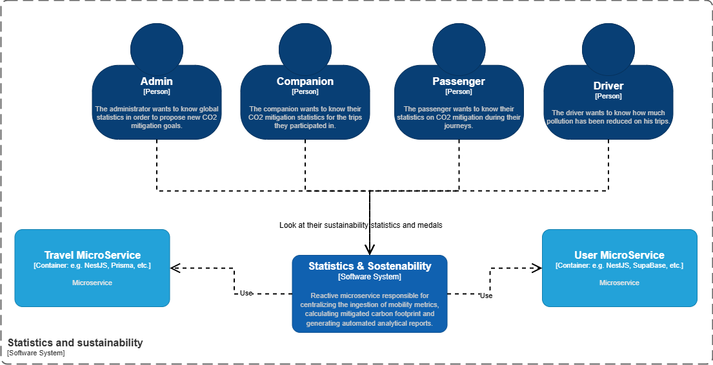
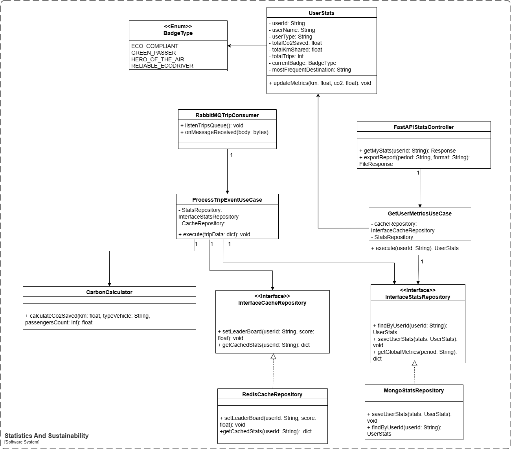
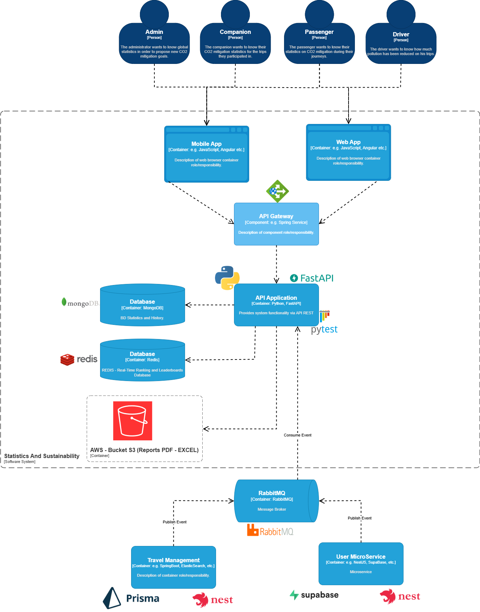
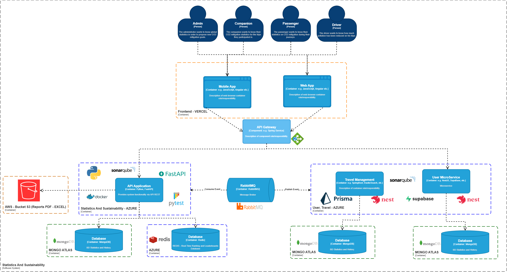
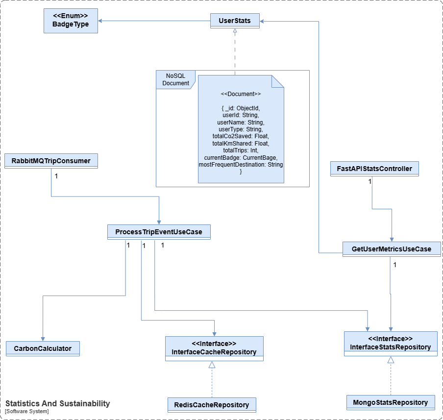
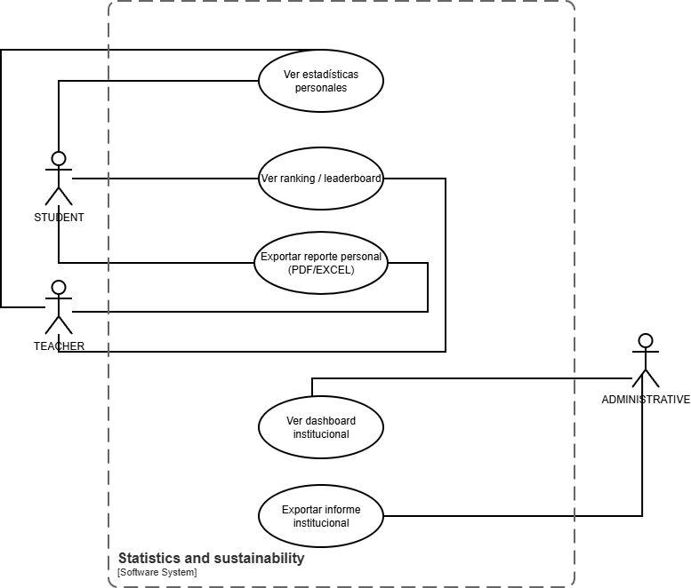

# 📊 Stats & Sustainability - Analytics Module
This module provides advanced analytical insights into the RideCI ecosystem, focusing on trip statistics, CO2 emission tracking, and sustainability metrics. It enables data-driven decision-making by aggregating user performance, trip efficiency, and environmental impact data.

## 👤 Developers
- Juan Pablo Caballero

## 📑 Content Table

1. [Project Architecture](#-project-architecture)
2. [API Endpoints](#-api-endpoints)
3. [Input and Output Data](#-input-and-output-data)
4. [Connections with Other Microservices](#-connections-with-other-microservices)
5. [Project Management and Agile Methodology](#-project-management-and-agile-methodology--statistics-module)
6. [Getting Started](#-getting-started)
7. [System Architecture & Design](#-system-architecture--design)
8. [Technologies](#-technologies)
9. [Quality Attributes](#-quality-attributes)
10. [Artificial Intelligence: Analysis and Prediction Engine](#-artificial-intelligence-analysis-and-prediction-engine-stickie-learn)
11. [Testing](#-testing)

---

## 🏢 Project Architecture
The Stats & Sustainability module follows an **unacoupled Hexagonal (Clean) Architecture**, isolating the business logic from infrastructure concerns.

* **🧠 Domain (Core)**: Contains business rules and statistic calculation logic (CO2 impact, sustainability scores).
* **🎯 Ports (Interfaces)**: Defines contracts for external communications.
* **🔌 Adapters (Infrastructure)**: Implementations of ports including Redis caching, MongoDB persistence, and FastAPI controllers.
---

## 🌟 Module Context

This diagram illustrates how our module connects to the rest of the platform. Essentially, we take trip and user data from other microservices, process it to obtain sustainability metrics, and deliver it in a user-friendly way for both administrators and end users. We are the analytics engine that transforms raw transportation data into environmental value.



---

## 📂 Clean - Hexagonal Structure
```
:📂 mortal-kombat-statistic-service
┣ :📂 src/
┃ ┣ :📂 rideci/
┃ ┃ ┣ :📂 core/               # Configuration and Settings
┃ ┃ ┣ :📂 domain/             # Entities and Models
┃ ┃ ┣ :📂 application/        # Use Cases
┃ ┃ ┗ :📂 infrastructure/     # Adapters (Repositories, Routers)
┣ 📄 .env
┣ 📄 docker-compose.yml
┗ 📄 README.md
```
---

## 📡 API Endpoints
Documentation available at: `http://localhost:8000/docs`

| Method | URI | Description |
| :--- | :--- | :--- |
| `GET` | `/api/v1/stats/institutional` | Retrieves aggregated sustainability metrics for the institution, with optional filtering by time period and user type. |
| `GET` | `/api/v1/stats/leaderboard` | Fetches the top-performing users ranked by total CO₂ emissions saved. |
| `PATCH` | `/api/v1/stats/update-user` | Updates user profile information or modifies the user's institutional role/type. |
| `POST` | `/api/v1/stats/process-trip` | Processes a completed trip event and updates individual and institutional sustainability metrics. |
| `GET` | `/api/v1/stats/{user_id}/co2` | Returns the user's accumulated CO₂ savings along with equivalent environmental impact metrics (e.g., trees planted or flights avoided). |
| `GET` | `/api/v1/stats/{user_id}/predictions` | Retrieves AI-generated sustainability forecasts and personalized eco-predictions for the specified user. |
| `GET` | `/api/v1/stats/{user_id}/export/{file_format}` | Generates a sustainability report in the requested format, uploads it to Amazon S3, and returns a signed download URL. |
| `GET` | `/api/v1/stats/{user_id}` | Retrieves the complete statistical profile and sustainability indicators for a specific user. |
| `GET` | `/api/v1/stats/find-id/{user_name}` | Resolves a user's unique identifier from their display name. |

---

# #️⃣ Input and Output Data

## 1. Process Trip Event (Input)
| Field | Type | Description |
| :--- | :--- | :--- |
| `userId` | String | Unique user identifier. |
| `distance` | Float | Trip distance in kilometers. |
| `transportMode` | String | Transport type (e.g., CAR, BIKE, BUS). |

## 2. User Statistics (Output)
| Field | Type | Description |
| :--- | :--- | :--- |
| `totalTrips` | Integer | Total trips recorded. |
| `co2Saved` | Float | Total CO2 emissions avoided in kg. |
| `sustainabilityScore` | Float | Calculated eco-efficiency score. |
| `Bage Type` | enum |sustainability medal. |

---

## 🔗 Connections with other Microservices (Asynchronous Communication)
This module functions as a reactive service:
1. **Travel Management**: Publishes trip completion events consumed by this service.
2. **User Management**: Validates user data during metric ingestion.
3. **Redis Cache**: Optimizes performance for leaderboards and frequent user metric lookups.

---

# 📊 Project Management and Agile Methodology — Statistics Module

For the development of the **Statistics and Environmental Sustainability Module** of **RidECI**, we implemented an agile framework combining **User Story Mapping** for product planning and **SCRUM** for technical execution through **Jira Software**.

---

## 🗺️ 1. User Story Mapping (Product Planning)

We structured the user story map into three vertical maturity levels (Releases) to ensure incremental development and mitigate technical risks:

| Activity / Feature                    | MVP (Minimum Viable Product)                                                               | Release 2 (Scalability & Core)                                                                                                                                         | Release 3 (Engagement / UX)                                                                                                                            |
| :------------------------------------ | :----------------------------------------------------------------------------------------- | :--------------------------------------------------------------------------------------------------------------------------------------------------------------------- | :----------------------------------------------------------------------------------------------------------------------------------------------------- |
| **View Environmental Impact Metrics** | Synchronous storage of total kilometers traveled in the database when a trip is completed. | *N/A (Migrated to asynchronous architecture)*                                                                                                                          | *N/A*                                                                                                                                                  |
| **View High-Performance Dashboard**   | *N/A*                                                                                      | • Asynchronous event processing through a worker connected to **RabbitMQ**.<br>• Dashboard rendering (km and CO₂ savings) in < 150 ms using **Azure Cache for Redis**. | *N/A*                                                                                                                                                  |
| **Manage Reports**                    | *N/A*                                                                                      | Export of institutional reports (PDF/Excel) with monthly accumulated environmental impact mitigation data for School audits.                                           | *N/A*                                                                                                                                                  |
| **Manage Achievements**               | *N/A*                                                                                      | *N/A*                                                                                                                                                                  | • Virtual badge system (`BadgeType`) based on carbon mitigation achievements.<br>• **Leaderboard** (community ranking of the most eco-friendly users). |

### 🎯 Justification for the Incremental Approach

1. **MVP:** We focused exclusively on **data consistency**. The primary goal was to ensure that traveled kilometers were reliably recorded regardless of the ecosystem's complexity.

2. **Release 2 (Current State):** We addressed the quality attributes of **performance and decoupling**. By using RabbitMQ, we prevent overloading the main trip microservice developed by the team, while Redis guarantees high-speed read operations.

3. **Release 3:** The **gamification layer** is deferred until the underlying architecture reaches full stability, encouraging platform adoption through badges and rankings.

---

## 📅 2. SCRUM Execution (Jira Software)

The microservice is currently in **Sprint 1**, implementing the technical scope defined in Release 2 of the product roadmap.

### 🚀 Active Sprint Information

* **Sprint Name:** `RidECI - Sprint 1: Core Ingestion and Metrics`
* **Duration:** 2 weeks
* **Sprint Success Metrics:**

  1. Successful encrypted connectivity to **MongoDB Atlas** and **Azure Cache for Redis** clusters.
  2. RabbitMQ event processing with response times below 200 ms.
  3. Minimum unit test coverage of 80% using **PyTest**.

### 🎫 Committed User Stories (Backlog)

#### [STATS-1] Individual Environmental Metrics Visualization (5 SP)

> **As a** student or professor of the School,
> **I want** to view my statistics dashboard (shared kilometers, CO₂ saved, and current badge),
> **So that** I can understand my positive environmental impact when using RidECI.

**Acceptance Criteria:**

* The endpoint `GET /api/v1/stats/me` must return a JSON object containing:
  `totalCo2Saved`, `totalKmShared`, `totalTrips`, `currentBadge`, and `userName`.
* **Cache Hit:** If data exists in Redis, the response must be returned in less than 150 ms.
* **Cache Miss:** If data does not exist in Redis, query MongoDB Atlas, update Redis, and return the response.

#### [STATS-2] Asynchronous Processing of Completed Trips (5 SP)

> **As a** statistics microservice,
> **I want** to asynchronously consume completed-trip events from RabbitMQ,
> **So that** user sustainability indicators are automatically updated.

**Acceptance Criteria:**

* A persistent worker must listen to the `rideci.trips.finished` queue through AMQP.
* Automatic invocation of the environmental conversion logic (`CarbonCalculator`) without affecting the user experience.

#### [STATS-3] Software Quality and Test Coverage (3 SP)

> **As a** technical architecture lead,
> **I want** to automate unit testing and static code analysis,
> **So that** the module remains maintainable and reliable.

**Acceptance Criteria:**

* Business logic code coverage greater than 80%.
* Successful **SonarQube Quality Gate** execution with zero critical vulnerabilities.


## 🚀 Getting Started
This project uses **FastAPI** with **Python 3.12**.

### Clone & Run
```bash
git clone [https://github.com/RIDECI/mortal-kombat-statistic-service](https://github.com/RIDECI/mortal-kombat-statistic-service)
cd mortal-kombat-statistic-service
docker-compose up -d --build´
```
## 📐 System Architecture & Design
This section provides a visual representation of the module's architecture, illustrating the flow of trip data, sustainability metrics, and the interaction between internal components and external services.

### 🧠 Hexagonal Architecture Flow
---
The diagram below illustrates how the Stats & Sustainability module centralizes trip data processing. The system receives trip events, which are processed by the **Domain Engine** to calculate CO2 impact and sustainability scores. The **Infrastructure Adapters** then ensure this data is persisted in MongoDB for long-term analysis, while concurrently updating the high-performance Redis cache to power real-time leaderboards.

### 💠 Sequence: Metric Processing
---
When a trip is completed, the following sequence occurs:
1. **Event Receipt**: The service consumes a `TripCompletedEvent`.
2. **Domain Logic**: The `CalculateStatsUseCase` computes the impact based on the transport mode.
3. **Data Sync**: 
    - The repository updates the `UserStats` document in **MongoDB**.
    - The repository invalidates or updates the specific `user_id` entry in **Redis**.
4. **Leaderboard Refresh**: The score is pushed to the Redis Sorted Set, allowing the frontend to display real-time global sustainability rankings.

### 🏗️ Class Structure & Domain Model
---
T# Structure and Description

The design of this module is based on the **Hexagonal Architecture (Ports and Adapters)** and **Clean Architecture** patterns, completely isolating business rules from persistence and data transport technologies.

## 🔴 A. Domain Layer

This is the core of the application and has no dependencies on external libraries or frameworks.

### UserStats (Entity)

Represents the consolidated state of a university community user's achievements and ecological indicators.

* **userId / userName / userType**: Identify the user and allow statistics to be segmented and filtered by institutional roles (Students, Professors, Administrative Staff).
* **totalCo2Saved / totalKmShared / totalTrips**: Cumulative attributes that record the user's net environmental impact and participation.
* **currentBadge**: Instantiates the `BadgeType` enum to associate the user's badge.
* **mostFrequentDestination**: Statistically stores the most common destination for mobility analytics.
* **updateMetrics(km, co2)**: Method responsible for mutating the entity's internal state by applying new increments.

### BadgeType (Enum)

Strictly defines the allowed gamification badges (`ECO_COMPLIANT`, `GREEN_PASSER`, `HERO_OF_THE_AIR`, `RELIABLE_ECO_DRIVER`), preventing the use of error-prone free-text strings.

### CarbonCalculator (Domain Service)

Contains the mathematical logic and conversion factors required to calculate the grams of CO₂ mitigated based on distance (km), `vehicleType`, and the number of passengers (`passengersCount`).

## 🔵 B. Application Layer

Defines the system use cases and interacts exclusively with the domain and abstractions (interfaces).

### ProcessTripEventUseCase (Use Case)

Orchestrates asynchronous event ingestion. It receives a raw completed-trip event, delegates calculations to the `CarbonCalculator`, retrieves and updates statistics (`UserStats`) through the persistence port, and updates ranking structures.

### GetUserMetricsUseCase (Use Case)

Handles dashboard queries. It implements an efficient read strategy by first consulting the fast-cache port before accessing the historical repository.

### InterfaceStatsRepository & InterfaceCacheRepository (Ports / Interfaces)

Define the contract or method signatures required by the application, completely abstracting how and where data is stored.

## 🟢 C. Infrastructure Layer

Contains the concrete technological implementations that connect the application with the external world.

### FastAPIStatsController (HTTP Input Adapter)

Exposes REST endpoints (`getMyStats`, `exportReport`) consumed by the RidECI Frontend.

### RabbitMQTripConsumer (Asynchronous Input Adapter)

Listens to the asynchronous messaging queue and transforms messages from the trip modules to trigger the corresponding use case.

### MongoStatsRepository (Output Adapter)

Implements `InterfaceStatsRepository` to permanently persist consolidated historical documents in **MongoDB**.

### RedisCacheRepository (Output Adapter)

Implements `InterfaceCacheRepository` using **Redis** in-memory data structures (such as Sorted Sets) for real-time leaderboard processing and high-speed responses (<150 ms).



## 🧠 2. Architectural Justification: Why Was It Designed This Way?

### 1. Dependency Inversion Principle

By applying Hexagonal Architecture, dependency arrows always point toward the center (Domain/Application). The databases (`MongoStatsRepository` and `RedisCacheRepository`) *implement* the application interfaces through UML realization relationships (◁----). This means that if the institution decides to migrate from MongoDB to PostgreSQL in the future, *not a single line of business logic or use-case code will be affected*; it will only be necessary to create a new adapter in the infrastructure layer.

### 2. Decoupling and Asynchronous Scalability

The module does not expose direct write endpoints for trip registration. By relying on asynchronous event consumption through *RabbitMQ*, the system can process thousands of concurrent trips without blocking the user experience in the frontend or overloading the application's core services.

### 3. Performance Through Storage Segregation

A polyglot persistence architecture was adopted:

* **MongoDB** is responsible for transactional, consistent, and complex storage used for generating weekly or monthly executive reports.
* **Redis** acts as a high-speed read cache and real-time computation layer for university gamification, reducing the analytical workload on the primary database and ensuring optimal performance.

### 🧩 Component Interaction
---
The system is organized into decoupled layers:
* **Event Ingestion**: Receives raw trip data via RabbitMQ.
* **Calculation Engine**: The core business logic evaluates the environmental impact.
* **Persistence Layer**:
    * **MongoDB**: Acts as the system of record, storing historical user statistics.
    * **Redis**: Used as a high-speed cache for leaderboards, ensuring low-latency access.
* **External Adapters**: Connects to the Auth service for validation and the Travel module for event synchronization.




### ☁️ Cloud Infrastructure & Deployment (Hybrid Azure/AWS)
---
Our deployment strategy is hybrid. While the application logic and primary databases reside in **Azure**, we leverage **AWS S3** for durable, cost-effective storage of generated sustainability reports and historical data backups.

* **Azure Cloud**: Hosts the FastAPI backend, MongoDB clusters, and Azure Redis Cache.
* **AWS S3**: Serves as our long-term storage bucket for finalized analytical reports generated by the statistics service, ensuring geographic redundancy and high durability.



---

### 🗄️ Database Schema & Persistence Strategy (Statistics Module)
The UserStats domain model is designed as a document-oriented structure, optimized for high-read performance within our MongoDB collection. It maintains a consolidated view of user environmental impact, preventing the need for complex joins across multiple tables.

* **UserStats Document:** Acts as the central aggregate root. It encapsulates all critical performance indicators, including totalCo2Saved, totalKmShared, and totalTrips.

* **Dynamic Analytics:** Fields like currentBadge (linked to BadgeType enum) and mostFrequentDestination allow for real-time gamification and personalized reporting without re-calculating historical trip data on every request.

* **Interface-Driven Persistence:** We employ the Repository Pattern via InterfaceStatsRepository. This allows the application to remain agnostic of the underlying database engine, facilitating seamless transitions or migrations from MongoDB to other storage solutions if required.



---

## 👤 User Roles & Use Case Analysis (Statistics Module)

This Use Case diagram defines the functional scope and interaction boundaries of the **RIDECI Statistics Module**, organizing stakeholders according to their responsibilities, permissions, and analytical needs.

### 🎓 Academic Stakeholders (Student & Teacher)

Both **Students** and **Teachers** have access to a set of personalized analytical features designed to promote sustainable mobility and encourage active participation within the platform.

- **Personalized Analytics:** Users can access their own travel statistics, allowing them to monitor personal performance and environmental impact over time.
- **Engagement:** The leaderboard feature promotes healthy competition by ranking users according to their sustainability contributions, increasing motivation and community participation.
- **Portability:** Users can export their personal statistics in **PDF** or **Excel** formats, enabling them to maintain records of their achievements for academic, professional, or personal purposes.
- **Role Hierarchy:** Teachers inherit the same analytical capabilities as students, allowing them to monitor their own activity while participating equally in the sustainability initiatives.

### 🏛️ Administrative Stakeholders

Administrative users focus on institutional monitoring and decision-making through aggregated information rather than individual user analytics.

- **Institutional Oversight:** Administrators access an institutional dashboard that presents aggregated metrics and key performance indicators without exposing individual user information, preserving privacy.
- **Strategic Reporting:** Administrators can generate institution-wide reports that support policy development, sustainability assessments, and long-term planning based on collective mobility data.
- **Data Governance:** Their permissions are limited to organizational analytics, ensuring a clear separation between personal statistics and institutional reporting responsibilities.


---

## 🛠️ Technologies

### 🖥️ Core Development & Logic


### 🗄️ Data Persistence & Message Broker


### ☁️ Cloud Infrastructure & Deployment


### CI/CD & Quality Assurance


### Documentation & Testing


### Design


### Comunication & Project Management


---

## 🛡️ Quality Attributes
* **Scalability**: The system uses a decoupled event-driven architecture to handle high volumes of trip events.
* **Performance**: Redis implementation ensures leaderboard queries have sub-millisecond response times.
* **Maintainability**: Hexagonal structure allows replacing infrastructure (e.g., changing database) without affecting business logic.
* **Reliability**: Fault-tolerant communication via asynchronous message brokers.

---

## 🤖 Artificial Intelligence: Analysis and Prediction Engine ("Stickie Learn")

The RidECI Statistics Module integrates a hybrid intelligence engine designed to transform historical data into proactive insights, following the continuous learning methodology known as **Stickie Learn**.

### 🧠 Hybrid Intelligence Architecture

We combine the power of generative models with the mathematical precision of machine learning to deliver a personalized experience for the community of the *Escuela Colombiana de Ingeniería Julio Garavito*.

| Component               | Technology                | Functional Purpose                                                                |
| :---------------------- | :------------------------ | :-------------------------------------------------------------------------------- |
| **Generative Insights** | `Google Gemini 3.5 Flash` | Student context analysis and generation of personalized tactical recommendations. |
| **Predictive Engine**   | `Scikit-learn`            | Linear regression applied to historical trip data to predict future CO₂ savings.  |

### How Does Our Engine Work?

#### 1. Hyper-Personalized Insights & Automated Reporting (Gemini)

Through the **Generative Insights** architecture, the system analyzes the user's profile—including frequent destinations, earned badges, and recent activity history. This integration has two primary fronts:

- Tactical Recommendations: Gemini processes behavioral information to generate motivational messages and intelligent challenges (Smart Challenges), maximizing student engagement with sustainability.

- Intelligent Documentation: Our Report Generator Engine leverages generative AI to transform raw tabular data into executive summaries. When exporting reports (PDF/Excel), the engine performs an automated qualitative analysis, translating metrics into professional insights, customized feedback, and actionable recommendations based on the user's specific performance and status.

#### 2. Numerical Prediction (Scikit-learn)

We use linear regression models trained on real data stored within our infrastructure. This engine learns from every trip recorded in `MongoStatsRepository`, enabling environmental impact projections to become increasingly accurate as they adapt to individual driving behavior and the number of shared passengers.

#### 3. Resilience and Code Quality

The implementation ensures high availability through:

* **Fallback Logic:** If the Gemini API is unavailable, the system automatically degrades to a safe heuristic model, ensuring that users always receive meaningful feedback.
* **Decoupling:** All AI-related functionality is encapsulated through the `InterfacePredictionEngine` interface, enabling a fully testable, loosely coupled architecture validated under strict SonarQube quality and coverage standards.

---

## 🧪 Testing
Testing is an essential part of the project functionality, ensuring that our sustainability metrics are accurate and our code is maintainable.

### 📊 Code Coverage (Pytest) and 🔎 Static Analysis (SonarQube)
---
We maintain high standards for code quality and reliability:

* **Unit Testing**: We use **Pytest** to create a robust suite that covers the domain logic. Every use case and calculator is tested in isolation to ensure that CO2 calculations are mathematically precise.
* **Integration Testing**: We test the communication between our service and the infrastructure adapters (Redis/MongoDB) to ensure data consistency.
* **Static Analysis**: We use **SonarQube** to perform static analysis on every pull request, identifying code smells, vulnerabilities, and ensuring technical debt is kept to a minimum.
* **Code Coverage**: We monitor coverage metrics to ensure that all critical paths, especially the `CarbonCalculator` and `UseCases`, are fully exercised by our tests.

[Click here for Pytest Coverage Report](./docs/reports/pytest.png)